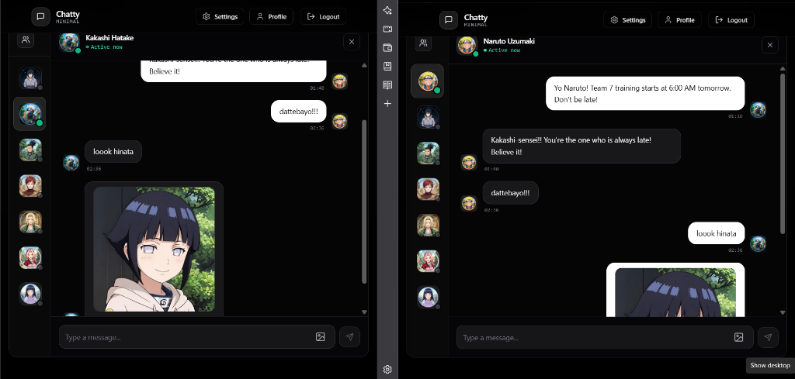
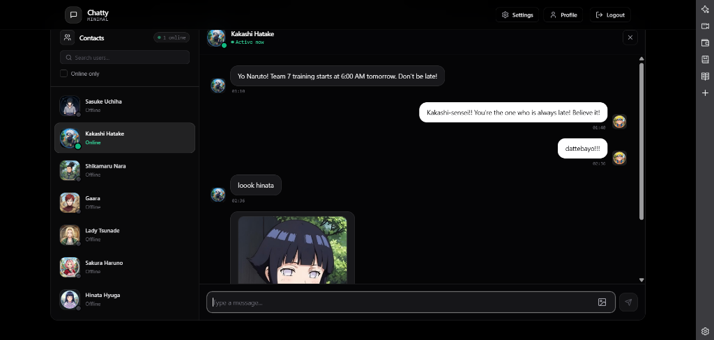
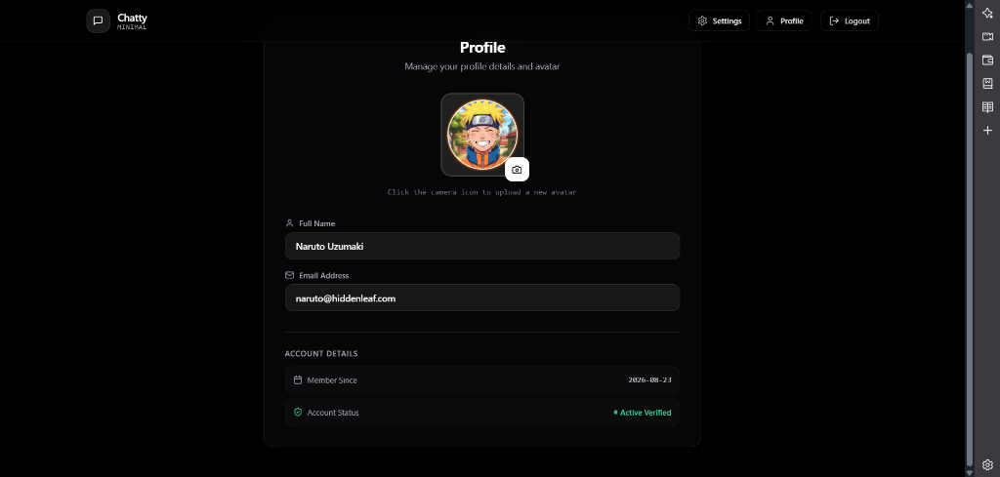

# 🍃 Hidden Leaf Village — Real-Time Shinobi Messaging Platform

<div align="center">


[](https://hidden-leaf-village-udab.onrender.com)

[](https://reactjs.org/)
[](https://nodejs.org/)
[](https://expressjs.com/)
[](https://socket.io/)
[](https://www.mongodb.com/)
[](https://tailwindcss.com/)
[](https://opensource.org/licenses/MIT)

**A high-performance real-time messaging network engineered for the shinobi of the Hidden Leaf Village. Built with a sleek monochrome aesthetic, glassmorphic UI, and fluid micro-animations.**

### 🌐 [Click Here to Open Live Application](https://hidden-leaf-village-udab.onrender.com)

Developed by **[Ishant Gupta](https://github.com/Ishant6565)**

</div>

---

## 📸 Interface Previews

### 1. Real-Time Dual-Client Transmissions & Media Sharing
> *Bidirectional WebSockets in action between Naruto Uzumaki and Kakashi Hatake with seamless instant image delivery powered by Cloudinary.*

<div align="center">
  
</div>

---

### 2. Shinobi Directory & Active Conversation
> *High-contrast monochrome message thread, instant live contact search, and real-time online presence indicators.*

<div align="center">
  
</div>

---

### 3. Shinobi Profile Management
> *Minimalist dark profile management interface featuring Cloudinary-powered avatar uploads and verified status badges.*

<div align="center">
  
</div>

---

## ⚡ Live Demo & Shinobi Accounts

Try out the live deployment immediately with pre-configured shinobi profiles:

- **Live URL:** **[https://hidden-leaf-village-udab.onrender.com](https://hidden-leaf-village-udab.onrender.com)**

### Demo Accounts (Password for all: `1234567890`)
| Shinobi | Email | Role |
| :--- | :--- | :--- |
| **Naruto Uzumaki** | `naruto@hiddenleaf.com` | Genin / Future Hokage |
| **Kakashi Hatake** | `kakashi@hiddenleaf.com` | Team 7 Captain / Copy Ninja |
| **Sasuke Uchiha** | `sasuke@hiddenleaf.com` | Shadow Shinobi / Uchiha Clan |
| **Hinata Hyuga** | `hinata@hiddenleaf.com` | Byakugan Princess |
| **Shikamaru Nara** | `shikamaru@hiddenleaf.com` | Chief Strategist |
| **Lady Tsunade** | `tsunade@hiddenleaf.com` | Fifth Hokage |
| **Gaara** | `gaara@hiddenleaf.com` | Fifth Kazekage |
| **Sakura Haruno** | `sakura@hiddenleaf.com` | Medical Ninja |

---

## ✨ Key Features

- **⚡ Real-Time Messaging:** Instant bidirectional shinobi transmissions powered by **Socket.io** WebSockets.
- **🟢 Live Presence Tracking:** Real-time online/offline status indicators with animated status badges.
- **🔒 Secure Authentication:** JWT-based authentication stored in `httpOnly` secure cookies with bcrypt password hashing.
- **🖼️ Media Sharing Pipeline:** Seamless shinobi intelligence and image upload via **Cloudinary API**.
- **🎨 Sleek Monochrome Aesthetic:** Modern black-and-white minimalist design with custom glassmorphism surfaces, smooth slide-up message animations, and dark mode UI.
- **🔍 Instant Contact Search:** Client-side live search and filter for quick conversation discovery.
- **🎭 Multi-Theme Switcher:** 32 customizable themes (powered by DaisyUI) with real-time interactive preview.
- **📱 Fully Responsive:** Adaptive layout tailored for mobile, tablet, and desktop screens.

---

## 🛠️ Tech Stack

### **Frontend**
- **Framework:** React 18 with Vite
- **State Management:** Zustand
- **Styling:** TailwindCSS + DaisyUI
- **Icons:** Lucide React
- **Notifications:** React Hot Toast
- **Client Networking:** Axios & Socket.io-client

### **Backend**
- **Runtime:** Node.js (ES Modules)
- **Framework:** Express.js
- **Database:** MongoDB Atlas with Mongoose ODM
- **Real-Time Engine:** Socket.io
- **Security:** JSON Web Tokens (JWT), Bcrypt.js, Cookie-Parser, CORS
- **Media Storage:** Cloudinary SDK

---

## 📁 Architecture Overview

```text
hidden-leaf-village/
├── backend/
│   ├── src/
│   │   ├── controllers/      # Auth & message business logic
│   │   ├── lib/              # Database connection, Socket.io, Cloudinary config
│   │   ├── middleware/       # JWT route protection middleware
│   │   ├── models/           # Mongoose User & Message schemas
│   │   ├── routes/           # Express API route endpoints
│   │   ├── seeds/            # Shinobi database initialization scripts
│   │   └── index.js          # Express app entry point
│   └── package.json
│
├── frontend/
│   ├── public/               # Shinobi avatars & static assets
│   ├── src/
│   │   ├── components/       # Reusable UI components & skeletons
│   │   ├── pages/            # Home, Login, Signup, Profile, Settings
│   │   ├── store/            # Zustand global auth, chat, and theme stores
│   │   ├── lib/              # Axios instance and date formatters
│   │   ├── App.jsx           # Routing & global providers
│   │   └── index.css         # Custom animations & glassmorphism utilities
│   └── package.json
│
├── screenshots/              # UI preview screenshots for documentation
├── package.json              # Monorepo build orchestrator
├── render.yaml               # Cloud deployment blueprint
├── LICENSE                   # MIT License
└── README.md
```

---

## 👨‍💻 Author

**Ishant Gupta**
- **GitHub:** [@Ishant6565](https://github.com/Ishant6565)
- **Live Project:** [Hidden Leaf Village](https://hidden-leaf-village-udab.onrender.com)
- **Portfolio:** [Portfolio Website](https://github.com/Ishant6565/portfolio)

---

## 📄 License

This project is licensed under the [MIT License](LICENSE) — see the LICENSE file for details.
